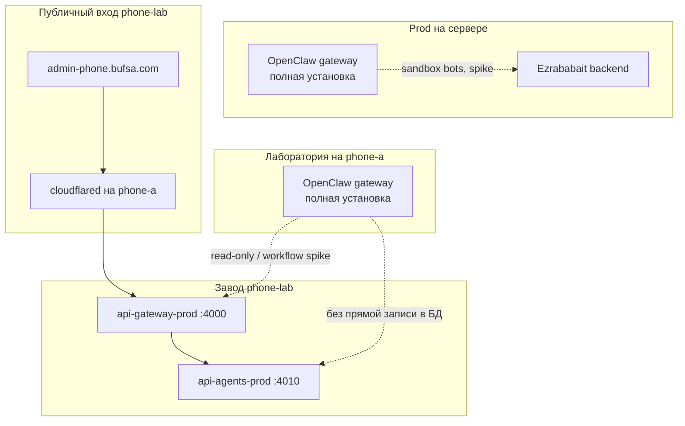

# OpenClaw в Phone Lab

> **Статус:** решение зафиксировано + Phase 14 outline  
> **Дата:** 2026-07-10  
> **PRIMARY_LAB_RUNTIME:** `openclaw`  
> **Контекст:** слой поверх mesh и параллельно с prod на сервере — **не замена** `api-agents-prod`

---

## 1. Зачем этот документ

Две параллельные линии развития:

| Линия | Где | Роль |
|-------|-----|------|
| **Prod (сейчас)** | Сервер (GCP / VPS) | Основной бэкенд Ezrababait (`ezrababait.bufsa.com`) |
| **Phone Lab (эксперимент)** | Телефоны в Tailscale | Весь бэкенд на Android — R&D, `admin-phone.bufsa.com` |

**OpenClaw** — agent runtime для быстрых экспериментов: **мессенджеры** (Telegram, WhatsApp sandbox), skills, диалоги, маркетинговые идеи. Это **лаборатория**, не второй оркестратор компании.

Удачные идеи переносятся в `api-agents` (handler, workflow node, prompt template) и проверяются smoke (`smoke:phase7+` на mesh, prod smoke на сервере).

### Решение команды

```
PRIMARY_LAB_RUNTIME=openclaw
```

Hermes Agent **не выбран** как primary. При необходимости — только отдельное устройство и отдельная задача (см. §8).

---

## 2. Текущий mesh (завод)

| Устройство | Tailscale IP | Сервисы |
|------------|--------------|---------|
| phone-a | `100.120.187.10` | `api-gateway-prod` :4000, `api-content-prod` :4004, cloudflared, **OpenClaw gateway** (Phase 14) |
| phone-b | `100.103.183.36` | `api-agents-prod` :4010, `api-auth` :4001, `api-marketing` :4008, Postgres, RabbitMQ, Redis |
| dev-pc | `100.98.162.107` | сборка, smoke |
| **сервер** | tailnet / публичный | prod бэкенд + **OpenClaw** (параллельная разработка) |

**Не ставить OpenClaw на phone-b** — ~4 GB RAM, agents + data plane; высокий риск OOM ([CURRENT-ARCHITECTURE.md](CURRENT-ARCHITECTURE.md)).

---

## 3. Архитектура: три слоя + два инстанса OpenClaw



| Слой | Инструмент | Роль |
|------|------------|------|
| Prod backend | Сервер | Рабочий prod, основная разработка фич |
| Публичный UI/API lab | Cloudflare + gateway на phone-a | Admin UI, прокси к mesh |
| Завод lab | `api-agents-prod` на phone-b | Workflow, артефакты, approve, логи |
| Лаборатория | **OpenClaw** (сервер + phone-a) | Spike мессенджеров, skills, диалоги |

### Два инстанса OpenClaw — разные роли

| Инстанс | Хост | Режим | Зачем |
|---------|------|-------|-------|
| **openclaw-server** | Prod-сервер (Linux) | Полная установка | Стабильный 24/7, мессенджеры без Android sleep, быстрые spike |
| **openclaw-phone-a** | phone-a (Termux, ~12 GB) | **Полная установка** (боевой режим) | Доказать agent runtime на телефоне в mesh; упрощать только если не тянет |

**Политика phone-a:** сначала ставим **полный** OpenClaw (gateway, каналы, skills по upstream). Если RAM/OOM/battery мешают — **тогда** упрощаем (отключить browser/local LLM, оставить cloud API + один канал). Не начинать с урезанной версии «на всякий случай».

### Критично: один бот — один gateway

Один Telegram-бот или одна WhatsApp-сессия **не может** работать на двух OpenClaw одновременно.

| Инстанс | Мессенджеры |
|---------|-------------|
| Сервер | Sandbox-боты (отдельные токены / номера) |
| phone-a | **Другие** sandbox-боты / номера (не те же, что на сервере) |

Workspace (skills, `SOUL.md`) можно синхронизировать через git; **токены каналов — разные**.

---

## 4. Где запускать OpenClaw

### 4.1 phone-a (primary mesh, пока нет phone-c)

| Параметр | Значение |
|----------|----------|
| Устройство | Xiaomi 14T, ~12 GB RAM |
| Режим | Полная установка OpenClaw |
| Соседи на том же телефоне | gateway :4000, content :4004 — не трогать порты |
| Миграция | При появлении **phone-c** — перенести OpenClaw с phone-a на phone-c; phone-a оставить только edge + content |

### 4.2 Сервер (параллельно)

| Параметр | Значение |
|----------|----------|
| ОС | Linux (официально поддерживаемый путь OpenClaw) |
| Режим | Полная установка |
| Интеграция | Spike → review → `api-agents` на **prod**; не путать с phone-lab mesh без явной цели |

### 4.3 Запрещено

- OpenClaw на **phone-b** (OOM)
- Один и тот же bot token на сервере и phone-a
- Прямая запись OpenClaw в Postgres phone-b

### 4.4 Порты (не конфликтовать с lab)

| Сервис | Порт |
|--------|------|
| api-gateway-prod | `4000` |
| api-auth-prod | `4001` |
| api-content-prod | `4004` |
| api-marketing-prod | `4008` |
| api-agents-prod | `4010` |
| PostgreSQL (phone-b) | `5432` |
| RabbitMQ | `5672` |
| Redis | `6379` |
| **OpenClaw gateway** | по умолчанию `18789` — **не** `4000` / `4010` |

### 4.5 Сеть

- **Tailscale** — обязателен для mesh и smoke с dev-pc (phone-a).
- **Публичный доступ** OpenClaw через cloudflared — не нужен на шаге 1 (webhook мессенджеров — отдельное решение позже).
- phone-a: bind на Tailscale IP `100.120.187.10` или `0.0.0.0` (если Termux/Android позволяет; при crash — loopback + SSH/tunnel с dev-pc).
- Сервер: стандартный onboard по [docs.openclaw.ai](https://docs.openclaw.ai/).

---

## 5. OpenClaw — upstream (install не дублируем)

| Ресурс | Ссылка |
|--------|--------|
| Репозиторий | [github.com/openclaw/openclaw](https://github.com/openclaw/openclaw) |
| Документация | [docs.openclaw.ai](https://docs.openclaw.ai/) |
| Onboard | `openclaw onboard --install-daemon` |
| Android (community) | Termux + Node 22+; F-Droid Termux; `termux-wake-lock`, battery Unrestricted |
| Android-клиент (опц.) | [openclaw-assistant](https://github.com/yuga-hashimoto/openclaw-assistant) |

Ориентир RAM на phone-a: gateway ~300–500 MB + Node; cloud LLM only на старте; local LLM — только если хватает RAM после smoke.

---

## 6. Границы интеграции

### 6.1 Разрешено / запрещено

| Разрешено | Запрещено |
|-----------|-----------|
| GET health / read-only probe mesh | Прямая запись в Postgres phone-b |
| Запуск workflow через admin API `api-agents` (осознанно) | Два writer'а одного артефакта |
| Spike в Telegram/WhatsApp **sandbox** | Prod WhatsApp + PII без workflow |
| Перенос prompt/skill → PR в `api-agents` | Вечная бизнес-логика только в OpenClaw |
| Параллельный spike на сервере и phone-a | Один bot token на двух gateway |

### 6.2 Spike → delivery

```
Эксперимент в OpenClaw (сервер или phone-a)
  → transcript / заметки
    → human review
      → api-agents: handler | workflow node | prompt template
        → smoke:phase7+ на phone-b (lab) и/или prod smoke на сервере
          → при необходимости demo:preflight
```

| Из lab | В api-agents |
|--------|--------------|
| Текст опроса для заказа | Узлы workflow `order_intake_*` (будущее) |
| Промпт для SEO-идеи | Agent template / refine prompt |
| Диалог в Telegram sandbox | Handler + channel adapter (будущее) |
| Crawl одного URL | Handler + allowlist (уже есть в заводе) |

---

## 7. Phase 14 — практический старт

Полный deploy-гайд — отдельная задача. Чеклист «первый вечер».

### 7.1 Сервер (параллельно, можно начать раньше)

1. `npm install -g openclaw@latest`
2. `openclaw onboard --install-daemon`
3. Подключить **sandbox** Telegram (отдельный бот)
4. Workspace в git (skills, `SOUL.md`)
5. Smoke: `openclaw dashboard` или health gateway

### 7.2 phone-a (полная установка)

1. **Mesh** — `npm run verify:mesh` с dev-pc ([PHASE-0-SETUP.md](PHASE-0-SETUP.md)).
2. **Termux** — [scripts/termux/bootstrap.sh](../scripts/termux/bootstrap.sh); Node 22+.
3. **OpenClaw** — upstream install (Termux native или proot Ubuntu — по community guide).
4. **Onboard** — полный wizard: gateway, API keys, **свой** sandbox Telegram (не токен с сервера).
5. **Bind** Tailscale; порт `18789` (или из config); **не** публиковать через cloudflared на шаге 1.
6. **Smoke с dev-pc:**
   ```bash
   # OpenClaw (порт из openclaw.json / onboard)
   curl -s "http://100.120.187.10:18789/health"

   # factory жив
   curl -s "http://100.103.183.36:4010/public/api/agents/health/live"
   curl -s "http://100.120.187.10:4000/api/health/live"
   ```
7. **Termux:Boot** — `boot-openclaw-phone-a.sh` по образцу [boot-stack-phone-b.sh](../scripts/termux/phone-b/boot-stack-phone-b.sh).
8. **Регрессия** — `npm run demo:preflight` не должен ломаться.

### 7.3 Если phone-a не тянет (fallback)

Упрощать **после** неудачи полной установки, по шагам:

1. Отключить local LLM / Ollama — только cloud API (Gemini и т.д.).
2. Отключить browser / тяжёлые skills.
3. Оставить один канал (Telegram sandbox).
4. Перенести тяжёлые spike на серверный OpenClaw; phone-a — health + read-only mesh probe.

### Критерий успеха Phase 14

- [ ] OpenClaw gateway отвечает на **сервере**
- [ ] OpenClaw gateway отвечает на **phone-a** по Tailscale с dev-pc
- [ ] Sandbox Telegram работает хотя бы на одном инстансе (цель — на обоих с разными ботами)
- [ ] Порты `4000` / `4010` не заняты OpenClaw
- [ ] `demo:preflight` зелёный
- [ ] Запись в [DEVICE-REGISTRY.md](DEVICE-REGISTRY.md): OpenClaw на phone-a

---

## 8. Hermes и второй runtime

| Вопрос | Статус |
|--------|--------|
| Hermes как primary | **Отклонён** |
| Второй runtime на том же телефоне | Нет |
| Hermes на отдельном устройстве | Только при явной задаче, не в Phase 14 |

---

## 9. Открытые решения

| Вопрос | Статус |
|--------|--------|
| Primary runtime | **`openclaw`** ✅ |
| phone-a: полная vs упрощённая установка | **Полная сначала**; упрощать при OOM/сбоях |
| Перенос на phone-c | Когда появится устройство |
| Bridge HTTP openclaw → gateway | Опционально, read-only |
| WhatsApp sandbox webhook (публичный) | Следующий шаг после Telegram smoke |
| Синхронизация workspace server ↔ phone-a | Git repo (TBD имя) |

---

## 10. Что этот документ не покрывает

- Пошаговый install OpenClaw (быстро устаревает → только upstream)
- Изменения в `api-gateway` / `api-agents` коде
- Прямая интеграция phone-lab OpenClaw с prod `ezrababait.bufsa.com` без review
- Отдельный поддомен для OpenClaw UI

---

## 11. Связанные документы

| Документ | Содержание |
|----------|------------|
| [PHASE-14-IMPLEMENTATION-PLAN.md](PHASE-14-IMPLEMENTATION-PLAN.md) | План реализации Phase 14 (waves, acceptance) |
| [PHASE-14-DEPLOY.md](PHASE-14-DEPLOY.md) | Deploy OpenClaw на phone-a |
| [OPENCLAW-SERVER-RUNBOOK.md](OPENCLAW-SERVER-RUNBOOK.md) | Deploy OpenClaw на prod-сервер |
| [OPENCLAW-SPIKE-WORKFLOW.md](OPENCLAW-SPIKE-WORKFLOW.md) | Spike → review → api-agents |
| [PHASE-14-TELEGRAM-CHECKLIST.md](PHASE-14-TELEGRAM-CHECKLIST.md) | Telegram sandbox acceptance |
| [../openclaw-workspace/README.md](../openclaw-workspace/README.md) | Workspace git template (SOUL, skills) |
| [CURRENT-ARCHITECTURE.md](CURRENT-ARCHITECTURE.md) | Текущий layout mesh |
| [CLOUDFLARE-PUBLIC-DOMAIN.md](CLOUDFLARE-PUBLIC-DOMAIN.md) | `admin-phone.bufsa.com` + tunnel |
| [DEVICE-REGISTRY.md](DEVICE-REGISTRY.md) | IP, роли устройств |
| [PHASE-0-SETUP.md](PHASE-0-SETUP.md) | Tailscale mesh |
| [TROUBLESHOOTING.md](TROUBLESHOOTING.md) | OOM, boot, mesh |
| [../../PHONE-LAB-MOB-PLAN.md](../../PHONE-LAB-MOB-PLAN.md) | История mob → prod phases |

---

## 12. FAQ

**Чем phone-lab отличается от prod на сервере?**  
Телефоны — эксперимент «весь бэкенд на Android»; сервер — рабочий prod. OpenClaw на обоих для параллельных spike, но factory остаётся `api-agents`.

**Зачем OpenClaw, если есть api-agents?**  
Завод — предсказуемые workflow; OpenClaw — быстрые эксперименты с мессенджерами и skills без миграций БД.

**Почему OpenClaw на phone-a, а не phone-b?**  
phone-b на пределе RAM; content уже уехал на phone-a из-за OOM.

**Почему два OpenClaw (сервер + phone-a)?**  
Сервер — стабильность и мессенджеры 24/7; phone-a — полный agent runtime в mesh. Разные bot tokens.

**Когда упрощать phone-a?**  
Только если полная установка не проходит smoke или ломает gateway/content (`demo:preflight`, OOM).

**Как идея попадает в api-agents?**  
Spike → review → handlers/workflows → smoke.

**Что нельзя?**  
Прямая запись в БД из lab, один бот на двух gateway, Drive как живая БД.
