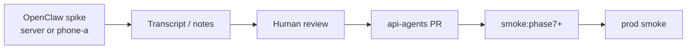

# OpenClaw spike → api-agents workflow

> **Контекст:** [OPENCLAW-LAB.md](OPENCLAW-LAB.md) §6.2  
> OpenClaw — лаборатория; `api-agents-prod` — factory. Удачные идеи переносятся вручную.

---

## Pipeline



```
Эксперимент в OpenClaw (сервер или phone-a)
  → transcript / заметки
    → human review (checklist ниже)
      → api-agents: handler | workflow node | prompt template
        → smoke:phase7+ на phone-b (lab mesh)
          → prod smoke на сервере (при необходимости)
            → demo:preflight (если затронут mesh)
```

---

## Что переносить

| Из lab (OpenClaw) | В api-agents |
|-------------------|--------------|
| Текст опроса для заказа | Узлы workflow `order_intake_*` (будущее) |
| Промпт для SEO-идеи | Agent template / refine prompt |
| Диалог в Telegram sandbox | Handler + channel adapter (будущее) |
| Crawl одного URL | Handler + allowlist (уже есть в заводе) |
| Skill / SOUL.md идея | Prompt template или workflow step |

---

## Review checklist

Перед PR в `api-agents`:

| # | Question | Pass |
|---|----------|------|
| 1 | Нет PII / prod данных в sandbox logs? | ☐ |
| 2 | Идея переносима в workflow, а не one-off skill? | ☐ |
| 3 | Нет прямой записи в БД из spike? | ☐ |
| 4 | Промпт/handler тестируем без OpenClaw? | ☐ |
| 5 | Не дублирует существующий workflow? | ☐ |
| 6 | Smoke plan определён (`smoke:phase7+` минимум)? | ☐ |

**Reject** если: spike требует постоянного OpenClaw runtime, содержит prod WhatsApp + PII, или два writer'а одного артефакта.

---

## Transcript export

На инстансе OpenClaw:

1. Найти session log в workspace (`~/.openclaw/` или `~/openclaw-workspace/`)
2. Скопировать релевантный диалог в spike note (markdown)
3. Сохранить в `openclaw-workspace/spikes/YYYY-MM-DD-<topic>.md` (git)

Шаблон spike note:

```markdown
# Spike: <title>
- **Date:** YYYY-MM-DD
- **Instance:** openclaw-server | openclaw-phone-a
- **Channel:** Telegram sandbox
- **Goal:** что проверяли

## Transcript (excerpt)
...

## Outcome
- Keep in OpenClaw only | Promote to api-agents

## Proposed api-agents change
- handler: ...
- workflow node: ...
- prompt: ...
```

---

## PR в api-agents

1. Ветка от `dev`
2. Минимальный diff: handler / node / prompt — без OpenClaw dependency
3. `npm run build` + smoke-local при возможности
4. PR description: ссылка на spike note
5. После merge: `ci_phone_lab_agents_release.yml` → pull-deploy на phone-b (opt-in)

---

## Smoke после merge

```powershell
cd C:\workspace\Ezrababait-2023\phone-lab
npm run smoke:phase7
npm run demo:preflight
```

При изменении prod-only логики — отдельный prod smoke на сервере.

---

## Bot naming convention

| Instance | Bot prefix | Example |
|----------|------------|---------|
| Server | `ezra-lab-srv-` | `ezra-lab-srv-seo-bot` |
| phone-a | `ezra-lab-phone-a-` | `ezra-lab-phone-a-intake` |

**Один bot — один gateway.** Никогда не шарить token между server и phone-a.

---

## Запрещено

- Вечная бизнес-логика только в OpenClaw
- Прямая запись OpenClaw в Postgres phone-b
- Prod WhatsApp + PII без workflow
- Автоматический merge spike → prod без review
