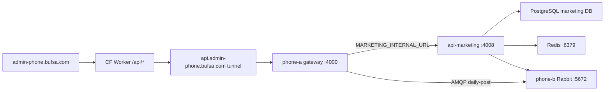

# Phase 12 — api-marketing on Phone Lab

Deploy [`api-marketing`](../../api-marketing) on the phone mesh so the admin UI at `https://admin-phone.bufsa.com` can reach marketing routes through **phone-a gateway** (`MARKETING_INTERNAL_URL` → HTTP proxy).

**Primary host:** phone-b (`100.103.183.36`) — PostgreSQL + RabbitMQ already colocated.  
**Fallback host:** phone-a (`100.120.187.10`) — if phone-b OOM, `npm install`, or health fails after restarts.



---

## Prerequisites

| Item | Check |
|------|-------|
| Phase 9 gateway prod on phone-a | `npm run smoke:gateway-prod` PASS |
| Phase 11 api-auth on phone-b | `npm run smoke:phase11` PASS |
| `api-marketing/.env` on dev PC | Real secrets merged at deploy |
| `mesh.env` + SSH keys | `npm run remote:setup` |
| Phones on charger, Tailscale connected | `npm run verify:mesh` |

---

## Quick deploy (from dev PC)

```powershell
cd C:\workspace\Ezrababait-2023\phone-lab
npm run deploy:phase12
```

This will:

1. Build `api-marketing` on PC → `marketing-prod.tgz`
2. Merge `api-marketing/.env` into phone template (missing keys keep `phone-lab-placeholder`)
3. Deploy to **phone-b** (auto-fallback to phone-a on failure)
4. Install deps, create `marketing` DB, start Redis + api-marketing `:4008`
5. Set `MARKETING_INTERNAL_URL` on phone-a gateway and restart
6. Write `mesh.marketing.env` (gitignored)
7. Run `smoke:phase12` + regression smokes

### Force fallback host

```powershell
powershell -File scripts/deploy-phase12.ps1 -Target phone-a
# or after phone-b OOM:
powershell -File scripts/deploy-phase12.ps1 -Target phone-a -SkipBuild
```

---

## Acceptance (P12)

| ID | Check |
|----|-------|
| P12-1 | `GET <marketing-host>:4008/api/health/live` → `{status:"alive"}` |
| P12-2 | `GET <marketing-host>:4008/api/health/ready` → 200 (PG + heap) |
| P12-3 | Gateway `MARKETING_INTERNAL_URL` = marketing Tailscale IP |
| P12-4 | After admin login: `GET phone-a:4000/api/facebook/portfolios` → **not 503** |
| P12-5 | `npm run smoke:phase12` PASS |
| P12-6 | `smoke:phase11`, `smoke:gateway-prod`, `smoke:public` — no regression |

---

## Manual verification (Termux)

**On marketing host (phone-b or phone-a):**

```bash
curl -s http://127.0.0.1:4008/api/health/live
curl -s http://127.0.0.1:4008/api/health/ready
tail -40 ~/phone-lab/logs/marketing-prod.log
pgrep -af api-marketing-prod
```

**On phone-a gateway:**

```bash
grep MARKETING_INTERNAL_URL ~/phone-lab/packages/api-gateway-prod/.env
curl -s http://127.0.0.1:4000/api/health/live
```

**From dev PC (after login):**

```powershell
npm run smoke:phase12
```

---

## Config files

| File | Purpose |
|------|---------|
| `config/marketing-prod.phone-b.env.example` | phone-b template (local PG, Rabbit, Redis) |
| `config/marketing-prod.phone-a.env.example` | phone-a fallback (local PG+Redis, Rabbit → phone-b) |
| `config/gateway-prod.phone-a.env.public.example` | `MARKETING_INTERNAL_URL` example |
| `mesh.marketing.env` | Deploy output: `MARKETING_PHONE`, `MARKETING_IP` |

---

## Boot order (phone-b)

`boot-stack-phone-b.sh`: PG → Rabbit → Redis → **(content only if `CONTENT_PHONE=phone-b` in `mesh.content.env`)** → api-agents → api-auth → **api-marketing**

When content runs on phone-a (current default after Phase 13 fallback), phone-b boot **does not** start content-prod. See [CURRENT-ARCHITECTURE.md](CURRENT-ARCHITECTURE.md).

Termux:Boot hooks:

- `install-boot-marketing.sh` (in api-marketing-prod package)
- Existing `boot-stack-phone-b` via api-agents-prod package

---

## Fallback procedure (move to phone-a)

1. Stop marketing on phone-b: `pkill -f api-marketing-prod/dist/main.js`
2. `powershell -File scripts/deploy-phase12.ps1 -Target phone-a -SkipBuild`
3. Gateway auto-wires to `http://100.120.187.10:4008`
4. `npm run smoke:phase12`

---

## Risks

| Risk | Mitigation |
|------|------------|
| phone-b OOM (5 services) | `HEAP_MAX_SIZE=240MB`; charger; fallback phone-a |
| Redis missing | `start-redis.sh` in boot stack |
| Joi requires many env keys | Merge real `api-marketing/.env` + placeholders |
| `google-ads-api` / `sharp` on ARM | `--ignore-scripts` first; retry without on phone-a |
| Gateway 503 Marketing unavailable | Wrong `MARKETING_INTERNAL_URL`; marketing not on `0.0.0.0:4008` |
| CRLF in uploaded `.sh` | `ensure-lf.ps1` + `sed -i 's/\r$//'` on phone |

---

## Not in scope (Phase 13+)

- Full Google Ads / TikTok / LinkedIn E2E on device
- Video compose / ffmpeg-heavy smoke
- Public exposure of `:4008` (gateway + admin JWT only)
- MongoDB, profile/drivers services

---

## Related docs

- [PHASE-11-DEPLOY.md](PHASE-11-DEPLOY.md) — admin auth via gateway
- [DEVICE-REGISTRY.md](DEVICE-REGISTRY.md) — ports and hosts
- [TROUBLESHOOTING.md](TROUBLESHOOTING.md) — Phase 12 section
