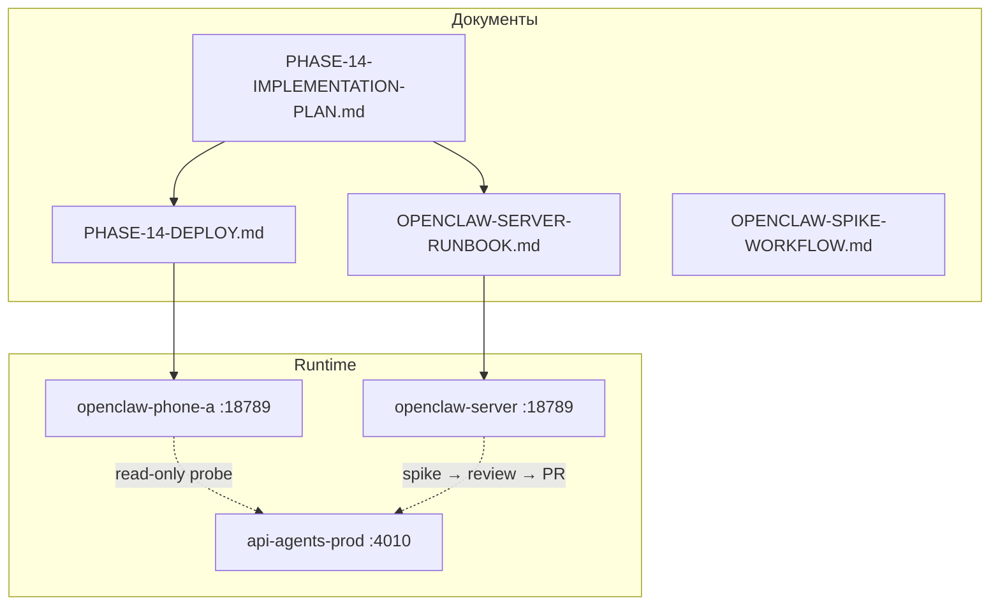

# Phase 14 — OpenClaw: план реализации

> **Статус:** активный план выполнения  
> **Дата:** 2026-07-10  
> **Контекст:** [OPENCLAW-LAB.md](OPENCLAW-LAB.md) — архитектурное решение  
> **Операции:** [PHASE-14-DEPLOY.md](PHASE-14-DEPLOY.md) (phone-a), [OPENCLAW-SERVER-RUNBOOK.md](OPENCLAW-SERVER-RUNBOOK.md) (сервер)

---

## 1. Контекст и текущее состояние

**Решение зафиксировано:** `PRIMARY_LAB_RUNTIME=openclaw`, Hermes отклонён, factory остаётся `api-agents-prod` на phone-b.

**Mesh Phases 0–13 — реализованы.** Phase 14 добавляет OpenClaw как lab runtime поверх mesh.

| Есть (до Phase 14) | Добавляется в Phase 14 |
|--------------------|-------------------------|
| Архитектура в `OPENCLAW-LAB.md` | Termux scripts, boot, watchdog |
| Паттерны boot/watchdog/smoke (7–13) | `smoke:phase14`, `deploy:phase14` |
| `scripts/termux/phone-a/*` gateway/content | OpenClaw scripts на phone-a |
| — | Server runbook, spike workflow, workspace template |



---

## 2. Принципы (не нарушать)

1. **Два инстанса, разные bot tokens** — сервер (sandbox A) и phone-a (sandbox B).
2. **OpenClaw не на phone-b** — OOM при ~4 GB RAM.
3. **Порт 18789** — не конфликтовать с `4000` / `4010`.
4. **Полная установка сначала**; упрощение — только после провала smoke/OOM.
5. **Нет cloudflared для OpenClaw на шаге 1**; WhatsApp webhook — отдельная фаза.
6. **Нет прямой записи в Postgres phone-b** из OpenClaw.
7. **Upstream install** — ссылаться на [docs.openclaw.ai](https://docs.openclaw.ai/), не дублировать install-гайд.

---

## 3. Android install strategy

**Primary: proot Ubuntu 22.04** — community-validated путь (libc, sharp, phantom-process killer).

**Fast path: native Termux** — если Node 24+ уже есть и smoke проходит за один вечер.

```
native Termux install → smoke:phase14
  ├─ PASS → зафиксировать native в DEVICE-REGISTRY
  └─ FAIL → proot Ubuntu → smoke:phase14
       ├─ PASS → зафиксировать proot
       └─ FAIL → fallback §7.3 OPENCLAW-LAB (cloud-only, 1 channel)
```

**Стабильность Android:** F-Droid Termux + Termux:Boot, `termux-wake-lock`, Battery Unrestricted, `tmux`, phantom-process killer (Android 12+), bind loopback по умолчанию.

---

## 4. Waves выполнения

| Wave | Содержание | Артефакты |
|------|------------|-----------|
| **0** | Документация | Этот файл, DEPLOY, SERVER-RUNBOOK, SPIKE-WORKFLOW |
| **1** | Серверный OpenClaw | Ручной deploy по SERVER-RUNBOOK |
| **2** | phone-a scripts | `scripts/termux/phone-a/*openclaw*`, env templates, `deploy-phase14.ps1` |
| **3** | Smoke | `smoke-phase14.mjs`, `mesh-env.mjs` extensions |
| **4** | Ops | watchdog, session-start, TROUBLESHOOTING, DEVICE-REGISTRY |
| **5** | Workspace git | `openclaw-workspace/` template, sync docs |
| **6** | Telegram sandbox | bot A (server) + bot B (phone-a), acceptance checklist |

### Рекомендуемый порядок

1. Wave 0 — документация
2. Wave 1 + Wave 2 — параллельно (сервер и phone-a)
3. Wave 3 → 4 — smoke + ops
4. Wave 5 + 6 — workspace + Telegram

---

## 5. Acceptance criteria (Phase 14 complete)

- [ ] OpenClaw gateway на **сервере** (`curl http://127.0.0.1:18789/health`)
- [ ] OpenClaw gateway на **phone-a** по Tailscale или SSH tunnel
- [ ] Sandbox Telegram на ≥1 инстансе (цель — оба с разными ботами)
- [ ] Порты `4000` / `4010` не заняты OpenClaw
- [ ] `npm run demo:preflight` зелёный
- [ ] `DEVICE-REGISTRY.md` обновлён: OpenClaw online

---

## 6. Риски и митигации

| Риск | Митигация |
|------|-----------|
| OOM на phone-a | RSS measure; fallback §7.3; перенос на phone-c |
| Android kills gateway | tmux + wake-lock + watchdog + session-start |
| Один bot на двух gateway | Naming: `ezra-lab-srv-*`, `ezra-lab-phone-a-*` |
| Upstream API drift | smoke:phase14 ловит breaking changes |
| OpenClaw ломает factory | smoke включает regression agents/gateway |

---

## 7. Future (вне Phase 14)

| Item | Когда |
|------|-------|
| WhatsApp sandbox + публичный webhook | После Telegram smoke |
| HTTP bridge OpenClaw → gateway (read-only) | По необходимости |
| Миграция OpenClaw phone-a → phone-c | При появлении устройства |
| Hermes на отдельном устройстве | Только по явной задаче |
| CI для OpenClaw | Не планируется |

---

## 8. Связанные документы

| Документ | Содержание |
|----------|------------|
| [OPENCLAW-LAB.md](OPENCLAW-LAB.md) | Архитектура, границы, FAQ |
| [PHASE-14-DEPLOY.md](PHASE-14-DEPLOY.md) | Deploy phone-a |
| [OPENCLAW-SERVER-RUNBOOK.md](OPENCLAW-SERVER-RUNBOOK.md) | Deploy prod-сервер |
| [OPENCLAW-SPIKE-WORKFLOW.md](OPENCLAW-SPIKE-WORKFLOW.md) | Spike → api-agents |
| [PHASE-14-TELEGRAM-CHECKLIST.md](PHASE-14-TELEGRAM-CHECKLIST.md) | Telegram sandbox acceptance |
| [openclaw-workspace/README.md](../openclaw-workspace/README.md) | Workspace git template |
